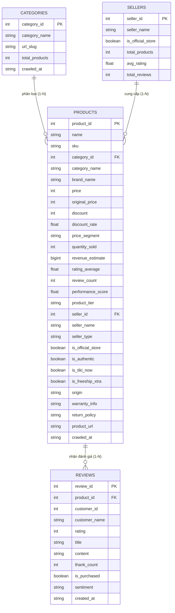

# BẢNG TỪ ĐIỂN DỮ LIỆU & CẤU TRÚC DỮ LIỆU CRAWL TIKI.VN
> **Đồ Án Big Data: Phân Tích Hệ Thống Dữ Liệu Sàn Thương Mại Điện Tử TIKI**  
> *Tài liệu tra cứu cấu trúc, ý nghĩa thuộc tính và quy mô dữ liệu thu thập*

---

## 1. TỔNG QUAN DỮ LIỆU CRAWL ĐƯỢC

Bộ cào dữ liệu đã thu thập thực tế từ nền tảng thương mại điện tử **Tiki.vn** thông qua **2 nguồn độc lập**:
- **Nguồn #1 (Tiki Public REST API)**: Thu thập danh mục, sản phẩm, đánh giá của khách hàng và nhà bán.
- **Nguồn #2 (Web Scraping trang chi tiết)**: Bóc tách thông số kỹ thuật (Specs), chính sách bảo hành và đổi trả.

### 📊 Bảng thống kê quy mô dữ liệu thực tế:
| Thực thể dữ liệu | Tệp tin lưu trữ | Định dạng | Số lượng bản ghi | Dung lượng |
| :--- | :--- | :---: | :---: | :---: |
| **Sản phẩm chuẩn hóa** | `dataset/tiki_products_clean_full.csv` | CSV (35 cột) | **2,307** sản phẩm | 1.36 MB |
| **Đánh giá khách hàng** | `dataset/raw/tiki_reviews.csv` | CSV (20 cột) | **35,632** đánh giá | 11.60 MB |
| **Ngành hàng (Danh mục)**| `dataset/raw/tiki_categories.csv` | CSV (7 cột) | **10** ngành hàng | 1 KB |
| **Nhà bán hàng (Sellers)**| `dataset/raw/tiki_sellers.csv` | CSV (6 cột) | **315** nhà bán | 12 KB |
| **Thông số kỹ thuật HTML**| `dataset/raw/tiki_product_details.csv` | CSV (12 cột) | **55** chi tiết | 274 KB |
| **Bảng Master 360 độ** | `dataset/tiki_master_dataset_all_in_one.csv` | CSV (57 cột) | **36,166** dòng | 34.05 MB |
| **CSDL Quan hệ SQLite** | `dataset/tiki_database.db` | SQLite RDBMS | 4 bảng quan hệ | 15.6 MB |
| **CSDL NoSQL JSON** | `dataset/nosql_documents/products_collection.jsonl` | JSON Documents | **2,307** documents | 2.9 MB |

---

## 2. CÀO CÁI GÌ? (NỘI DUNG THU THẬP TỪ TIKI)

### 2.1. Cào 10 Ngành Hàng Lớn Nhất Của Tiki:
1. **Điện Thoại - Máy Tính Bảng** (Category ID: `1789`)
2. **Thiết Bị Số - Phụ Kiện Số** (Category ID: `1815`)
3. **Điện Gia Dụng** (Category ID: `1882`)
4. **Nhà Sách Tiki** (Category ID: `8322`)
5. **Làm Đẹp - Sức Khỏe** (Category ID: `1520`)
6. **Thời Trang Nam** (Category ID: `915`)
7. **Thời Trang Nữ** (Category ID: `931`)
8. **Nhà Cửa - Đời Sống** (Category ID: `1883`)
9. **Bách Hóa Online** (Category ID: `4384`)
10. **Thể Thao - Dã Ngoại** (Category ID: `1975`)

### 2.2. Chi Tiết Các Thông Tin Bóc Tách:
- **Thông tin nhận diện**: Mã sản phẩm (ID), Mã quản lý kho (SKU), Tên đầy đủ, Đường dẫn URL, Ảnh đại diện.
- **Giá bán & Khuyến mãi**: Giá bán hiện tại, Giá niêm yết gốc, Số tiền giảm giá, Tỷ lệ chiết khấu (%), Phân khúc giá.
- **Chỉ số kinh doanh**: Số lượng sản phẩm đã bán thực tế, Doanh thu ước tính (VNĐ), Điểm hiệu năng, Phân hạng sản phẩm.
- **Đánh giá & Khách hàng**: Điểm đánh giá sao trung bình (1-5 sao), Tổng số lượt review, Nội dung bình luận tiếng Việt, Tên người mua, Lượt cảm ơn, Nhãn cảm xúc (Tích cực, Tiêu cực, Trung tính).
- **Thương hiệu & Nhà bán**: Tên thương hiệu, Tên shop bán hàng, Phân loại gian hàng chính hãng (Mall/Marketplace).
- **Dịch vụ & Vận chuyển**: Giao hàng siêu tốc 2 giờ TikiNOW, Miễn phí vận chuyển Freeship Xtra, Nơi xuất xứ, Tình trạng kho.
- **Nguồn #2 (Web Scraper)**: Bảng thông số kỹ thuật chi tiết (CPU, RAM, dung tích...), Chính sách bảo hành, Quy định đổi trả 30 ngày.

---

## 3. SƠ ĐỒ MỐI QUAN HỆ THỰC THỂ (ERD DIAGRAM)

Trong CSDL SQLite (`dataset/tiki_database.db`), 4 bảng được tổ chức quan hệ chuẩn 3NF:

---

## 4. TỪ ĐIỂN DỮ LIỆU CHI TIẾT (DATA DICTIONARY)

### 4.1. Bảng Sản Phẩm Chuẩn Hóa (`dataset/tiki_products_clean_full.csv` — 35 Cột)
Tập dữ liệu sạch phục vụ trực tiếp cho bài toán phân tích, học máy và hiển thị:

| STT | Tên cột (Field Name) | Kiểu dữ liệu | Mô tả ý nghĩa nghiệp vụ | Ví dụ thực tế |
| :---: | :--- | :---: | :--- | :--- |
| **1** | `product_id` | Integer (PK) | Mã định danh duy nhất của sản phẩm trên sàn Tiki | `279418598` |
| **2** | `name` | String | Tên thương mại đầy đủ của sản phẩm | `Điện Thoại Samsung Galaxy A07 5G 4GB/128GB` |
| **3** | `sku` | String | Mã quản lý kho hàng hóa | `5448826284393` |
| **4** | `category_id` | Integer (FK) | Mã định danh ngành hàng | `1789` |
| **5** | `category_name` | String | Tên danh mục ngành hàng | `Điện Thoại - Máy Tính Bảng` |
| **6** | `brand_id` | Integer | Mã số thương hiệu trong hệ thống Tiki | `18802` |
| **7** | `brand_name` | String | Tên thương hiệu sản xuất | `Samsung` |
| **8** | `price` | Integer | Giá bán khuyến mãi hiện tại (VNĐ) | `3390000` |
| **9** | `original_price` | Integer | Giá niêm yết ban đầu trước khi giảm (VNĐ) | `3990000` |
| **10** | `discount` | Integer | Số tiền được giảm (`original_price - price`) | `600000` |
| **11** | `discount_rate` | Float | Tỷ lệ chiết khấu giảm giá (%) | `15.0` |
| **12** | `price_segment` | String | Phân khúc giá kinh doanh | `Cận cao cấp (2Tr - 10Tr)` |
| **13** | `quantity_sold` | Integer | Tổng số lượng sản phẩm bán ra thực tế | `142` |
| **14** | `revenue_estimate` | BigInt | Doanh thu ước tính = `price * quantity_sold` (VNĐ)| `481380000` |
| **15** | `rating_average` | Float | Điểm đánh giá chất lượng trung bình (1.0 - 5.0) | `4.85` |
| **16** | `review_count` | Integer | Tổng số lượt bình luận nhận xét của khách | `38` |
| **17** | `performance_score` | Float | Điểm hiệu năng sản phẩm = $\log_{10}(\text{sold} + 1) \times \text{rating}$ | `10.45` |
| **18** | `product_tier` | String | Phân hạng kinh doanh: Ngôi Sao, Bò Sữa, Tiềm Năng... | `Tiềm Năng (High Potential)` |
| **19** | `seller_id` | Integer (FK) | Mã số định danh của cửa hàng / nhà bán | `1` |
| **20** | `seller_name` | String | Tên cửa hàng bán sản phẩm | `Tiki Trading` |
| **21** | `seller_type` | String | Loại hình nhà bán: Chính hãng (Mall) vs Marketplace | `Gian Hàng Chính Hãng (Mall)` |
| **22** | `is_official_store` | Boolean | True nếu là gian hàng phân phối chính thức | `True` |
| **23** | `is_authentic` | Boolean | Cam kết hàng chính hãng 100% | `True` |
| **24** | `is_tiki_now` | Boolean | Hỗ trợ vận chuyển siêu tốc 2 giờ | `True` |
| **25** | `is_freeship_xtra` | Boolean | Áp dụng ưu đãi miễn phí vận chuyển | `True` |
| **26** | `origin` | String | Nơi sản xuất / Xuất xứ sản phẩm | `Việt Nam` |
| **27** | `inventory_status` | String | Tình trạng tồn kho hàng hóa | `available` |
| **28** | `warranty_info` | String | Chính sách bảo hành sản phẩm (Nguồn #2) | `Bảo hành chính hãng 12 tháng` |
| **29** | `return_policy` | String | Chính sách đổi trả hàng hóa (Nguồn #2) | `Đổi trả trong 30 ngày` |
| **30** | `specifications` | Text | Bảng thông số kỹ thuật (RAM, ROM, Màn hình...)| `Chip Dimensity 6100+, Màn 6.6 inch 90Hz` |
| **31** | `short_description` | Text | Đoạn mô tả đặc tính sản phẩm | `Pin khủng 5000mAh, sạc nhanh 25W` |
| **32** | `product_url` | String | Đường dẫn trực tiếp đến trang web sản phẩm | `https://tiki.vn/dien-thoai-samsung-galaxy-a07...` |
| **33** | `thumbnail_url` | String | Đường dẫn ảnh thumbnail sản phẩm | `https://salt.tikicdn.com/cache/280x280/...` |
| **34** | `data_source` | String | Nguồn dữ liệu | `tiki_api` |
| **35** | `crawled_at` | DateTime | Thời điểm thực thi cào dữ liệu | `2026-10-02 08:58:25` |

---

### 4.2. Bảng Đánh Giá Khách Hàng (`dataset/raw/tiki_reviews.csv` — 20 Cột)
Tập dữ liệu 35,632 nhận xét thực tế phục vụ bài toán Khai phá Cảm xúc (NLP Sentiment):

| STT | Tên cột (Field Name) | Kiểu dữ liệu | Ý nghĩa thuộc tính | Ví dụ |
| :---: | :--- | :---: | :--- | :--- |
| **1** | `review_id` | Integer (PK) | Mã định danh duy nhất của đánh giá | `19482710` |
| **2** | `product_id` | Integer (FK) | Mã sản phẩm được nhận xét | `279418598` |
| **3** | `customer_id` | Integer | Mã tài khoản người mua hàng | `8492015` |
| **4** | `customer_name` | String | Họ tên người đánh giá | `Nguyễn Văn A` |
| **5** | `rating` | Integer | Số sao khách chấm (1 đến 5 sao) | `5` |
| **6** | `title` | String | Tiêu đề tóm tắt nhận xét | `Sản phẩm rất tốt` |
| **7** | `content` | Text | Nội dung bình luận chi tiết bằng tiếng Việt | `Máy dùng mượt mà, pin trâu, giao hàng 2h đúng hẹn.` |
| **8** | `thank_count` | Integer | Số người bấm nút "Hữu ích" cho bình luận | `12` |
| **9** | `is_purchased` | Boolean | Đã xác thực mua hàng thực tế từ Tiki | `True` |
| **10** | `has_images` | Boolean | Đánh giá có đính kèm hình ảnh thật không | `True` |
| **11** | `images` | Text | Danh sách URL ảnh thực tế khách chụp | `https://salt.tikicdn.com/...` |
| **12** | `seller_id` | Integer | Mã nhà bán tại thời điểm mua | `1` |
| **13** | `seller_name` | String | Tên nhà bán hàng | `Tiki Trading` |
| **14** | `product_attributes`| String | Phiên bản khách chọn (Màu sắc, Dung lượng) | `Màu: Đen, Bộ nhớ: 128GB` |
| **15** | `vote_agree` | Integer | Số lượt đồng ý với nhận xét | `12` |
| **16** | `vote_disagree` | Integer | Số lượt không đồng ý | `0` |
| **17** | `usage_duration` | String | Thời gian khách đã dùng trước khi đánh giá | `Đã dùng 1 tuần` |
| **18** | `sentiment` | String | Nhãn phân loại cảm xúc (POSITIVE, NEGATIVE, NEUTRAL)| `POSITIVE` |
| **19** | `created_at` | DateTime | Ngày khách đăng nhận xét trên Tiki | `2026-09-15 14:20:00` |
| **20** | `crawled_at` | DateTime | Thời gian bot cào bản ghi này | `2026-10-01 12:30:15` |

---

### 4.3. Bảng Danh Mục Ngành Hàng (`dataset/raw/tiki_categories.csv`)
- `category_id`: Mã danh mục (1789, 1815, 1882, 8322, 1520, 915, 931, 1883, 4384, 1975).
- `category_name`: Tên ngành hàng.
- `url_slug`: Đường dẫn URL danh mục trên Tiki.
- `total_products`: Tổng số sản phẩm hiện có của ngành trên sàn Tiki.

### 4.4. Bảng Nhà Bán Hàng (`dataset/raw/tiki_sellers.csv`)
- `seller_id`: Mã nhà bán (315 shop).
- `seller_name`: Tên gian hàng (Apple Flagship, Tiki Trading, Anker Official...).
- `is_official_store`: Gian hàng chính hãng (Mall).
- `total_products`: Số lượng sản phẩm shop đang bày bán.
- `avg_rating`: Điểm sao uy tín trung bình của shop.
- `total_reviews`: Tổng số đánh giá nhận được.

---

## 5. CÁC ĐỊNH DẠNG LƯU TRỮ TRONG HỆ THỐNG

Dữ liệu được lưu trữ linh hoạt theo 3 mô hình:
1. **Tập tin phẳng CSV / Parquet**: Dành cho phân tích nhanh và xử lý với Apache Spark (`tiki_products_clean_full.csv`, `tiki_master_dataset_all_in_one.csv`).
2. **CSDL Quan Hệ SQLite (RDBMS)**: Nằm tại [dataset/tiki_database.db](file:///Users/khoait/Documents/SourceCompany/bigdata_doan/dataset/tiki_database.db), cho phép thực thi truy vấn SQL qua `sqlite3`.
3. **CSDL Phi Cấu Trúc NoSQL (MongoDB-ready)**: Nằm tại [dataset/nosql_documents/products_collection.jsonl](file:///Users/khoait/Documents/SourceCompany/bigdata_doan/dataset/nosql_documents/products_collection.jsonl), mỗi dòng là 1 Document JSON lồng nhau sẵn sàng import vào MongoDB.
